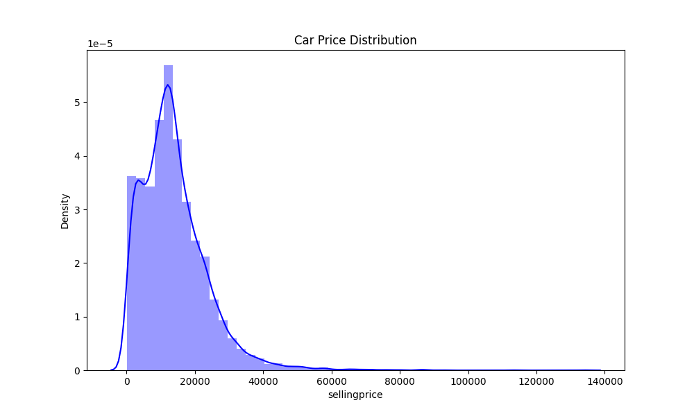
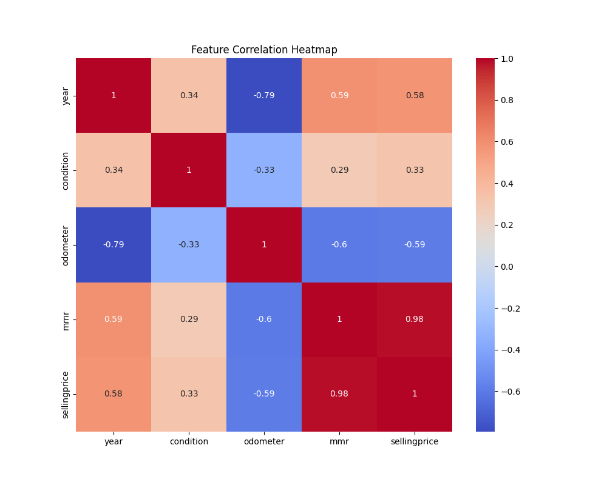
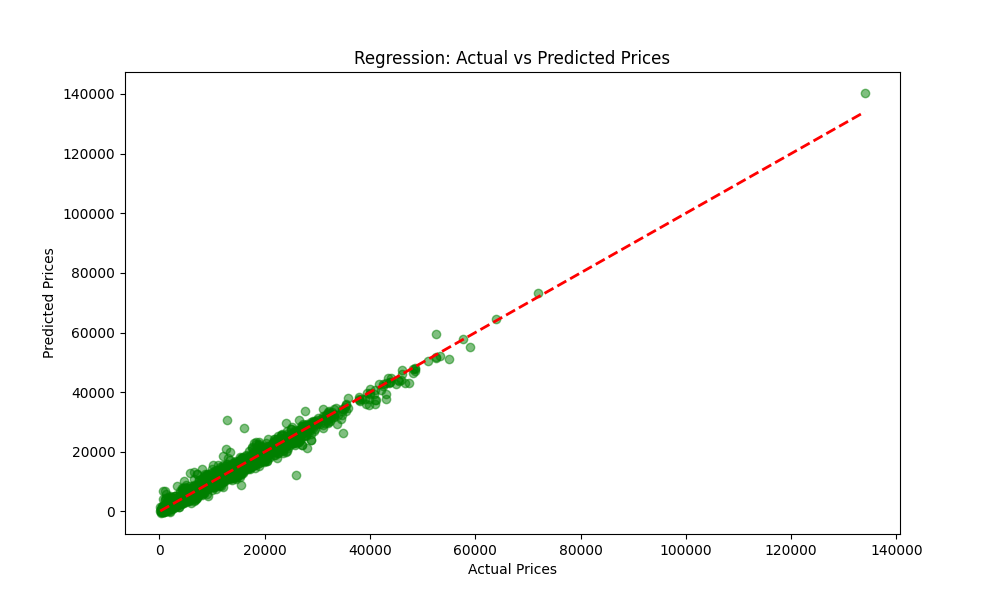
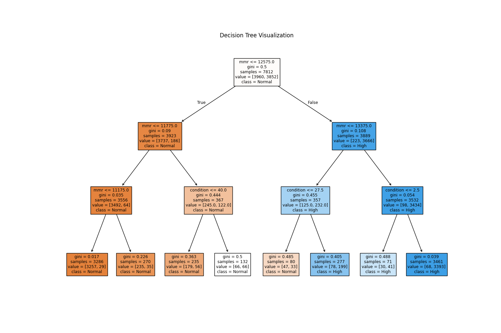
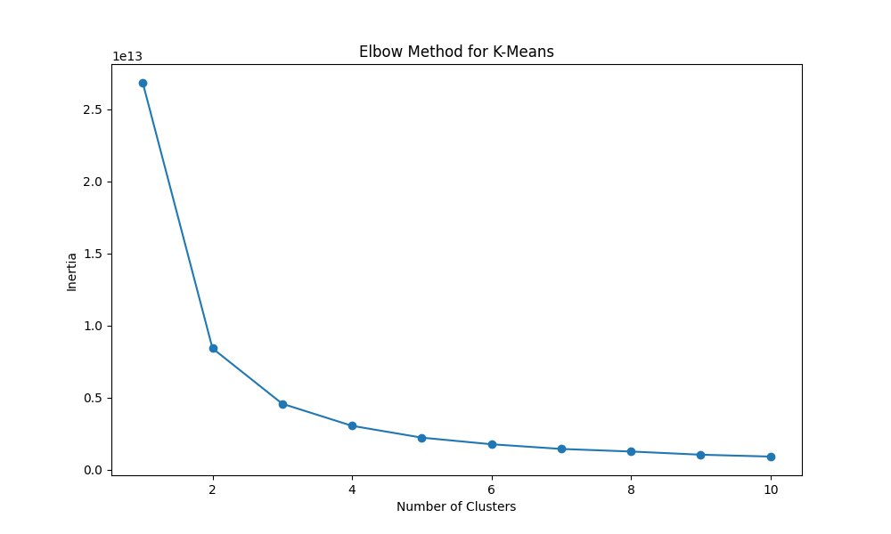
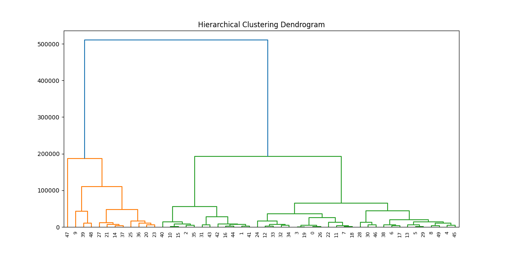
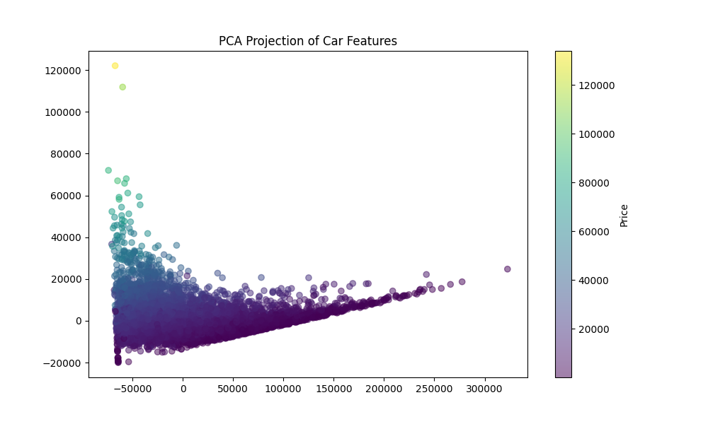
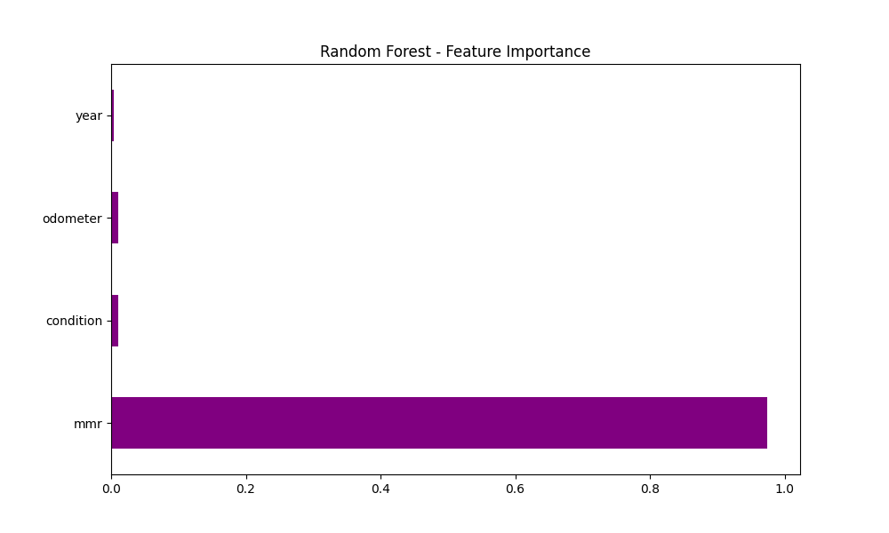

# Car Sale Prediction using Predictive Analytics

This project implements a complete predictive analytics pipeline for car sales pricing. It covers every aspect from data preprocessing to advanced neural networks and model performance evaluation.

## 📊 Project Units and Visualizations

The project is structured into six comprehensive units:

### Unit I: Introduction and Data Preparation
We performed data cleaning, handled missing values, and visualized the distribution of car prices and feature correlations.




### Unit II: Supervised Learning - Regression
We built Simple and Multiple Linear Regression models to predict car prices. The results show a high correlation between actual and predicted values.



### Unit III: Supervised Learning - Classification
We categorized cars into "High Price" and "Normal Price" groups. A Decision Tree was used to visualize the classification logic.




### Unit IV: Unsupervised Learning - Clustering
We used K-Means to segment the cars into clusters and Hierarchical Clustering to understand the feature hierarchy.




### Unit V: Dimensionality Reduction & Neural Networks
We applied Principal Component Analysis (PCA) to visualize the 4D dataset in 2D and trained a Multi-layer Perceptron (MLP) for advanced pricing prediction.



### Unit VI: Model Performance & Ensembles
We utilized Random Forest ensembles to achieve the highest predictive accuracy and analyzed feature importance.



## 🛠️ How to Run

1.  **Clone the Repo**:
    ```bash
    git clone https://github.com/DavidParantha/-CAR-SALES-PREDICTION-USING-PREDICTIVE-ANALYTICS-.git
    ```
2.  **Install Required Packages**:
    ```bash
    pip install pandas numpy matplotlib seaborn scikit-learn mlxtend scipy
    ```
3.  **Run the Analysis**:
    ```bash
    python main.py
    ```

## 💻 Technologies Used
- **Python**: Core programming language.
- **Scikit-learn**: For machine learning models and metrics.
- **Pandas/Numpy**: For data manipulation.
- **Seaborn/Matplotlib**: For all visualizations.
- **Mlxtend**: For association rules.
