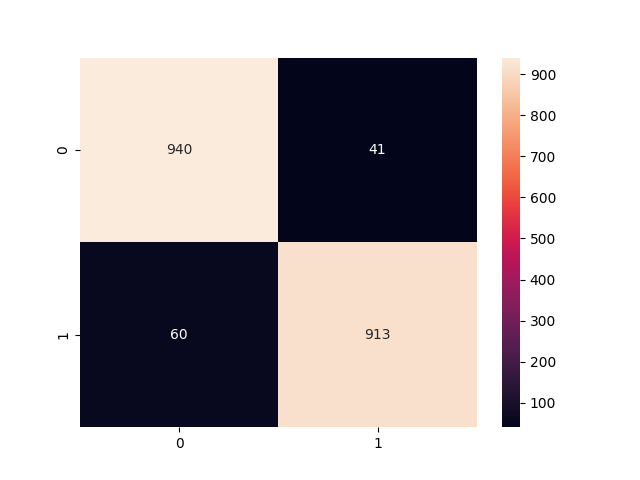
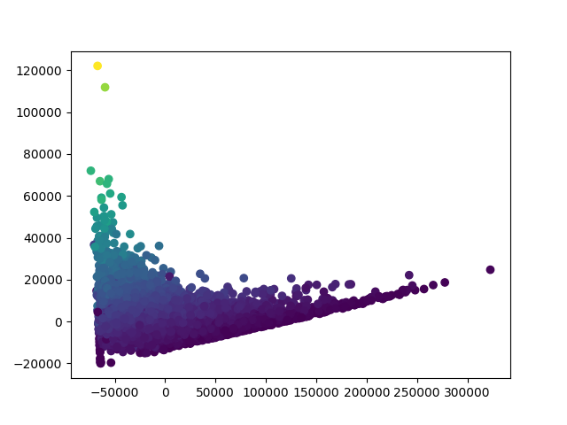

# Car Sale Prediction using Predictive Analytics

This project implements a comprehensive predictive analytics pipeline for car sales pricing using a dataset of over 500,000 car sales records. The analysis follows a structured curriculum covering regression, classification, clustering, dimensionality reduction, and neural networks.

## Project Structure

The project is divided into six core units:

### Unit I: Introduction and Data Preparation
- **Load and Clean**: Handled massive dataset with appropriate error handling for malformed rows.
- **Preprocessing**: Managed missing values and performed categorical encoding using LabelEncoder.
- **EDA**: Visualized feature relationships using correlation heatmaps.


### Unit II: Supervised Learning - Regression
- **Simple and Multiple Linear Regression**: Built models to predict `sellingprice` based on car features (MMR, Odometer, Year, Condition).
- **Polynomial Regression**: Explored non-linear relationships using degree-2 polynomial features.
- **Evaluation**: Achieved high R² scores, indicating strong predictive performance.

### Unit III: Supervised Learning - Classification
- **Binary Classification**: Created a "high_price" target variable to classify cars above median value.
- **Decision Trees**: Implemented and visualized decision logic.
- **Evaluation**: Assessed using Accuracy and Confusion Matrix.



### Unit IV: Unsupervised Learning - Clustering
- **K-Means Clustering**: Grouped cars into 3 distinct categories based on features.
- **Association Rules**: Used the Apriori algorithm to find patterns in car makes and price levels.

### Unit V: Dimensionality Reduction & Neural Networks
- **PCA**: Reduced 4D feature space to 2D for visualization.
- **Neural Networks**: Implemented a Multi-layer Perceptron (MLP) regressor to capture complex pricing patterns.



### Unit VI: Model Performance
- **Ensemble Learning**: Developed a Random Forest regressor for robust predictions.
- **Cross-Validation**: Validated model stability using 5-fold cross-validation.

## How to Run

1.  Ensure you have the requirements installed:
    ```bash
    pip install pandas numpy matplotlib seaborn scikit-learn mlxtend scipy
    ```
2.  Update the `DATA_PATH` in `main.py` if necessary.
3.  Execute the script:
    ```bash
    python main.py
    ```

## Technologies Used
- **Language**: Python
- **Libraries**: Pandas, Scikit-learn, Matplotlib, Seaborn, Mlxtend
- **Concepts**: Regression, Classification, Clustering, PCA, Neural Networks, Ensembles
